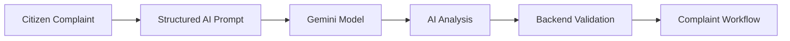

# CivicResolve — AI Pipeline

## 1. Overview

CivicResolve uses generative AI to analyze citizen complaints and assist with complaint triage.

The initial AI pipeline focuses on understanding a natural-language complaint and converting it into structured operational information.

---

## 2. Current AI Pipeline



---

## 3. AI Inputs

The primary input is the citizen's complaint information.

Examples include:

* Complaint title
* Complaint description
* Selected category where available
* Location information where relevant
* Department/category context available from the database

---

## 4. AI Outputs

The current analysis can contain:

```text
summary
predicted_category
predicted_department
predicted_priority
urgency
confidence
model_name
```

These outputs are stored as complaint analysis data where applicable.

---

## 5. Database-Aware Analysis

The AI service can use available department and category information to improve routing consistency.

This is important because the model should not freely invent department names.

Instead, AI predictions are validated against the application's configured organizational data.

---

## 6. Output Validation

AI output is treated as untrusted external data.

The backend validates the response before using it in the complaint workflow.

Validation should verify:

* Required fields exist
* Category is valid
* Department is valid
* Priority is valid
* Confidence is within an acceptable range
* Output structure is valid

Invalid or unusable output must not corrupt the complaint record.

---

## 7. Failure Handling

The AI provider is an external dependency.

Potential failures include:

* API unavailable
* Request timeout
* Invalid AI response
* Rate limits
* Network errors
* Unexpected model output

CivicResolve therefore includes failure handling so that an AI failure does not make the entire complaint-management system unusable.

---

## 8. Human-in-the-Loop Principle

AI is used primarily for assistance and triage.

The system maintains human control over important operational actions.

For example:

```text
AI
 ↓
Recommendation
 ↓
Validation
 ↓
Officer/Admin workflow
 ↓
Human decision
```

This becomes increasingly important as CivicResolve V2 adds AI-assisted resolution recommendations and SLA prediction.

---

## 9. Current AI Provider

The current implementation uses Google's Gemini API through the `google-genai` Python SDK.

The application configuration should keep API credentials outside source control using environment variables.

---

# 10. CivicResolve V2 AI Extensions

## 10.1 Duplicate Complaint Detection

The system will compare a new complaint with existing complaints and calculate similarity.

```text
New Complaint
      ↓
Semantic Representation
      ↓
Similarity Search
      ↓
Similarity Score
      ↓
Potential Duplicate
```

The system should distinguish between:

* Exact duplicates
* Highly similar complaints
* Related but separate complaints
* Unrelated complaints

---

## 10.2 SLA-Breach Prediction

V2 will introduce predictive SLA risk.

Potential signals include:

* Priority
* Complaint age
* Current status
* Department
* Officer workload
* Time remaining
* Historical resolution patterns

The output can be represented as:

```text
LOW RISK
MEDIUM RISK
HIGH RISK
```

or as a calibrated probability where appropriate.

---

## 10.3 Knowledge Base + Resolution Recommendation

V2 will introduce a knowledge base containing approved operational guidance.

```text
Complaint
    ↓
Retrieve relevant knowledge
    ↓
Relevant documents/articles
    ↓
AI reasoning
    ↓
Suggested resolution
    ↓
Officer review
```

The AI recommendation will not automatically close complaints.

---

## 10.4 Multimodal Complaints

V2 will expand complaint input to potentially include:

* Text
* Images
* Voice

The system will combine available information before producing the complaint analysis.

Example:

```text
Image
+
Voice description
+
Text
      ↓
Multimodal AI analysis
      ↓
Structured complaint
```

---

## 10.5 Smart Workload Balancing

The assignment engine will eventually consider more than active complaint count.

Potential factors include:

* Department
* Current workload
* Category expertise
* Previous workload
* Complaint priority
* SLA risk
* Availability

The result will be a suitability score used to support assignment.

---

## 10.6 Notifications

AI and workflow events will eventually trigger notifications for:

* New assignments
* SLA warnings
* Escalations
* Resolution
* Reopening
* Other important complaint events

---

## 11. AI Evaluation

The V2 AI components must be evaluated using test data rather than being judged only by visual inspection.

Potential metrics include:

### Classification

* Accuracy
* Precision
* Recall
* F1-score

### Duplicate Detection

* Precision
* Recall
* F1-score

### SLA Prediction

Depending on the final modeling approach:

* Accuracy
* Precision
* Recall
* F1-score
* ROC-AUC where appropriate

Actual results will be recorded after implementation and evaluation.

No evaluation metric should be claimed without measured evidence.
