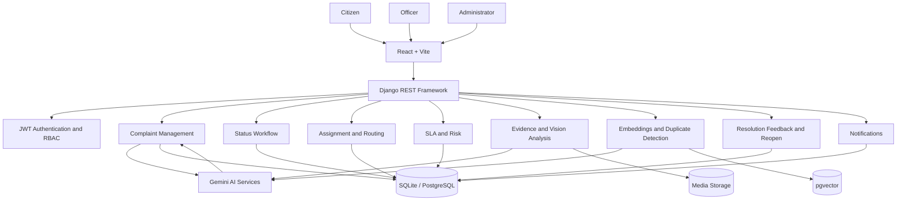

# CivicResolve — System Architecture

## 1. Architecture Overview

CivicResolve follows a client-server architecture. The React/Vite frontend provides role-specific interfaces and communicates with the Django REST Framework backend over HTTP. The backend enforces authentication, authorization, complaint workflow rules, AI processing, assignment, SLA handling, notifications, and persistence.



## 2. Frontend Architecture

The frontend is organized around pages, reusable components, authentication context, API service modules, layouts, and CSS files.

```text
frontend/src/
├── components/
├── context/
├── layouts/
├── pages/
├── services/
├── styles/
├── App.jsx
└── main.jsx
```

### Context

`AuthContext.jsx` maintains the current access token, refresh token, authenticated user, authentication state, and login/logout operations.

### Services

Axios is configured in `services/api.js`. Feature-specific service modules call backend endpoints for authentication, complaints, notifications, and user operations.

### Pages

Current application pages include:

- Login
- Citizen dashboard
- Officer dashboard
- Administrator dashboard
- Analytics dashboard
- SLA dashboard
- Complaint list
- Complaint creation
- Complaint details
- Profile
- Activity

## 3. Routing and Access Control

React routes use protected and role-aware route wrappers. The frontend routes users to the dashboard appropriate to their role.

Backend permissions remain authoritative. Frontend route restrictions are a user-interface layer and are not treated as the security boundary.

## 4. Backend Architecture

The backend is divided into Django applications:

```text
backend/
├── accounts/
├── organizations/
├── complaints/
├── notifications/
└── config/
```

### accounts

Provides the custom email-based user model, profile operations, authentication-related views, and role information.

### organizations

Stores departments and complaint categories and provides active department, category, and officer APIs.

### complaints

Contains the primary complaint domain, AI analysis, assignments, status history, SLA records, embeddings, duplicate candidates, evidence, resolution feedback, and complaint-related APIs/services.

### notifications

Stores in-app notifications and provides list/read/read-all operations.

## 5. AI Service Boundary

AI functionality is separated into services rather than being embedded directly in views.

The current provider implementation is `GeminiProvider`. It supports text generation and multimodal image generation and contains timeout, retry, and fallback handling.

## 6. Data and Storage

The application can use SQLite locally. When `DATABASE_URL` is supplied, Django parses the URL and uses that database configuration. The semantic embedding model uses pgvector and therefore requires PostgreSQL/pgvector support for the complete vector workflow.

Complaint evidence is stored through Django's media storage configuration.

## 7. Security Architecture

The backend uses:

- JWT authentication
- Role-specific permission classes
- Queryset filtering by authenticated user or assignment
- Django password validation
- CORS and CSRF configuration
- Secure-cookie and HTTPS-related production settings
- HTTP security headers
- API throttling

The backend is the final authorization boundary.
