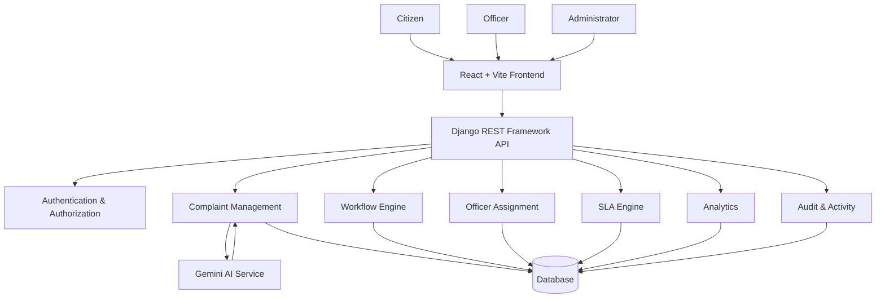
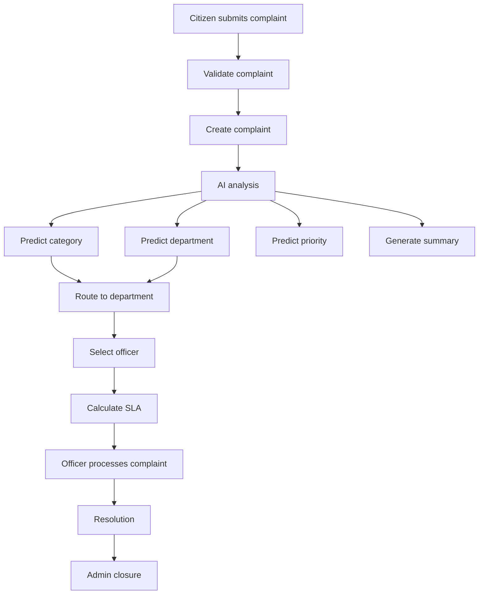

# CivicResolve — System Architecture

## 1. Overview

CivicResolve is an AI-powered grievance management and resolution platform designed to streamline the complete lifecycle of citizen complaints.

The system allows authenticated citizens to submit complaints, uses AI to analyze and classify them, routes complaints to the appropriate department, assigns them to officers, monitors SLA deadlines, supports resolution workflows, and provides administrators with analytics and oversight.

The platform currently uses a React/Vite frontend and a Django REST Framework backend.

---

## 2. High-Level Architecture



---

## 3. Frontend Architecture

The frontend is implemented using React and Vite.

Major responsibilities include:

* Authentication interface
* Role-based navigation
* Citizen dashboard
* Officer workspace
* Administrator dashboard
* Complaint submission
* Complaint tracking
* Complaint details
* SLA monitoring
* Analytics
* Profile
* Activity center
* Loading, error and empty states
* Responsive UI

The frontend communicates with the backend through REST APIs.

### Frontend structure

```text
frontend/
└── src/
    ├── components/
    ├── context/
    ├── layouts/
    ├── pages/
    ├── services/
    ├── styles/
    ├── App.jsx
    └── main.jsx
```

---

## 4. Backend Architecture

The backend is implemented using Django and Django REST Framework.

Major responsibilities include:

* Authentication
* Authorization
* User and role management
* Department and category management
* Complaint creation
* AI analysis
* Department routing
* Officer assignment
* Complaint state transitions
* Audit history
* SLA calculation
* SLA monitoring
* Escalation
* Analytics
* Activity tracking

### Backend structure

```text
backend/
├── accounts/
├── complaints/
├── organizations/
├── config/
└── manage.py
```

---

## 5. User Roles

CivicResolve supports three primary roles.

### Citizen

Citizens can:

* Submit complaints
* View their complaints
* Track complaint status
* View complaint history
* Provide resolution feedback
* Reopen eligible resolved complaints
* Manage their profile
* View their activity

### Officer

Officers can:

* View complaints assigned to them
* Acknowledge complaints
* Start complaint processing
* Resolve complaints
* View complaint information
* Follow the complaint workflow

### Administrator

Administrators can:

* View all complaints
* Assign complaints
* Reassign complaints
* Monitor SLA status
* Close resolved complaints
* View analytics
* Manage operational workflows

Authorization is enforced on the backend rather than relying only on frontend navigation.

---

## 6. Complaint Processing Flow



---

## 7. Complaint State Machine

Complaints follow controlled state transitions.

```text
SUBMITTED
    ↓
AI_ANALYZING
    ↓
ASSIGNED
    ↓
ACKNOWLEDGED
    ↓
IN_PROGRESS
    ├──→ NEEDS_INFORMATION
    │         ↓
    │    IN_PROGRESS
    │
    ├──→ ESCALATED
    │         ↓
    │    IN_PROGRESS
    │
    └──→ RESOLVED
              ├──→ CLOSED
              └──→ REOPENED
                         ↓
                     ASSIGNED
```

Invalid state transitions are rejected by the backend workflow service.

---

## 8. AI Integration

CivicResolve currently uses Google's Gemini API for complaint analysis.

The AI layer is responsible for interpreting natural-language complaints and producing structured analysis including:

* Summary
* Predicted category
* Predicted department
* Priority
* Urgency
* Confidence
* Model information

The backend validates AI output before applying it to the complaint workflow.

AI failure handling is implemented so that an external AI failure does not leave complaint creation in an unusable state.

---

## 9. SLA Architecture

Each complaint can receive an SLA based on its priority.

The SLA system tracks:

* Response deadline
* Resolution deadline
* Response completion
* Resolution completion
* Response breach
* Resolution breach

SLA monitoring can identify complaints approaching or exceeding their configured deadlines.

---

## 10. Auditability

Important complaint state changes are recorded in complaint history.

History can contain:

* Previous status
* New status
* User responsible for the change
* Comment
* Timestamp

This provides an operational audit trail for complaint processing.

---

## 11. Security Model

The backend is the authoritative security layer.

Security responsibilities include:

* Authentication
* Role-based authorization
* Object-level access control
* Request validation
* Environment-based secret management
* Controlled CORS configuration
* Protected administrative operations

The production security configuration will be reviewed before deployment.

---

## 12. Current Technology Stack

### Frontend

* React
* Vite
* React Router
* Axios
* CSS

### Backend

* Python
* Django
* Django REST Framework
* JWT authentication
* SQLite during development

### AI

* Google Gemini
* `google-genai`

### Supporting Technologies

* Git
* GitHub
* REST APIs
* Environment variables

---

## 13. Production Target Architecture

The production architecture is expected to use:

```text
User
  ↓
Production React Frontend
  ↓ HTTPS
Django REST API
  ↓
PostgreSQL
  │
  └── Gemini API
```

SQLite is suitable for early development and testing, while PostgreSQL is the planned production database.

---

## 14. V2 Extension Architecture

CivicResolve V2 will extend the existing architecture with:

1. Duplicate complaint detection
2. AI SLA-breach prediction
3. Knowledge base and AI resolution recommendations
4. Multimodal complaint submission
5. Smart officer workload balancing
6. Notifications

These components will be added incrementally rather than restructuring the entire system.

---

## 15. Engineering Principles

CivicResolve follows these principles:

* Backend-enforced authorization
* Explicit complaint state transitions
* Separation of business logic into services
* Validation of external AI output
* Auditability of important workflow changes
* Environment-based configuration
* Incremental feature development
* Testable business logic
* Production-oriented architecture
