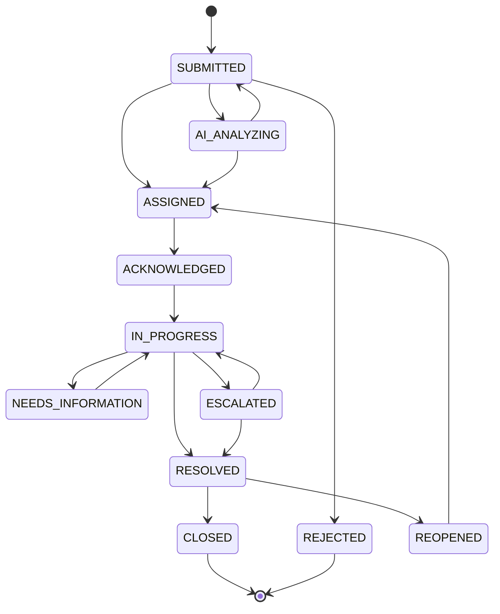

# CivicResolve — Complaint Lifecycle

## 1. Purpose

The complaint lifecycle defines how a complaint moves through CivicResolve from initial citizen submission to final closure.

The lifecycle is controlled by backend business rules so that invalid status transitions cannot be performed through the API.

---

## 2. Lifecycle



---

## 3. Submission

The citizen submits:

* Title
* Description
* Category
* Location information where available

The backend validates the request before creating the complaint.

A unique ticket number is generated for each complaint.

Example:

```text
CR-000020
```

---

## 4. AI Analysis

After complaint creation, AI analysis can determine:

* Summary
* Category
* Department
* Priority
* Urgency
* Confidence

The result is validated before being used by the workflow.

---

## 5. Department Routing

The predicted category is associated with a department.

Examples:

```text
Wi-Fi
   ↓
IT Support

Electrical
   ↓
Maintenance

Food
   ↓
Hostel

Bus
   ↓
Transport

CCTV
   ↓
Security
```

---

## 6. Officer Assignment

An eligible active officer is selected from the appropriate department.

Assignment rules include:

* Officer must be active
* Officer must belong to the required department
* Complaint must be eligible for assignment
* Administrative permissions are required for manual assignment

---

## 7. Acknowledgement

The assigned officer acknowledges the complaint.

```text
ASSIGNED
   ↓
ACKNOWLEDGED
```

---

## 8. Processing

The officer starts work on the complaint.

```text
ACKNOWLEDGED
   ↓
IN_PROGRESS
```

A complaint may require additional information or may be escalated.

---

## 9. Resolution

After completing the work:

```text
IN_PROGRESS
   ↓
RESOLVED
```

The resolution timestamp is recorded.

---

## 10. Closure

An administrator can close an eligible resolved complaint.

```text
RESOLVED
   ↓
CLOSED
```

The closure timestamp is recorded.

---

## 11. Reopening

A citizen can provide resolution feedback.

If the issue has not actually been resolved, the complaint can be reopened where permitted:

```text
RESOLVED
   ↓
REOPENED
   ↓
ASSIGNED
```

This sends the complaint back into the operational workflow.

---

## 12. Audit History

Important status changes create complaint history records.

Each record can capture:

* Complaint
* Previous status
* New status
* User who performed the change
* Comment
* Timestamp

This allows the system to reconstruct the operational history of a complaint.

---

## 13. SLA Interaction

The SLA system operates alongside the complaint lifecycle.

```text
Complaint
    ↓
Priority
    ↓
SLA Policy
    ↓
Response Deadline
    ↓
Resolution Deadline
    ↓
Monitoring
    ↓
Escalation when required
```

---

## 14. Design Principle

The complaint lifecycle is intentionally explicit.

The system does not allow arbitrary status changes such as:

```text
SUBMITTED → CLOSED
```

unless that transition is explicitly supported by the workflow rules.

This protects data integrity and makes the workflow predictable and testable.
